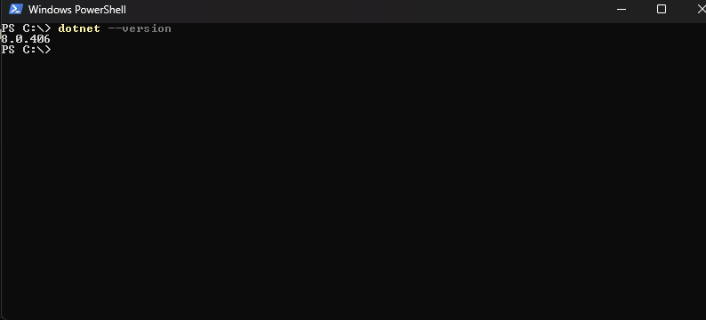
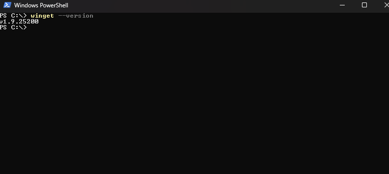
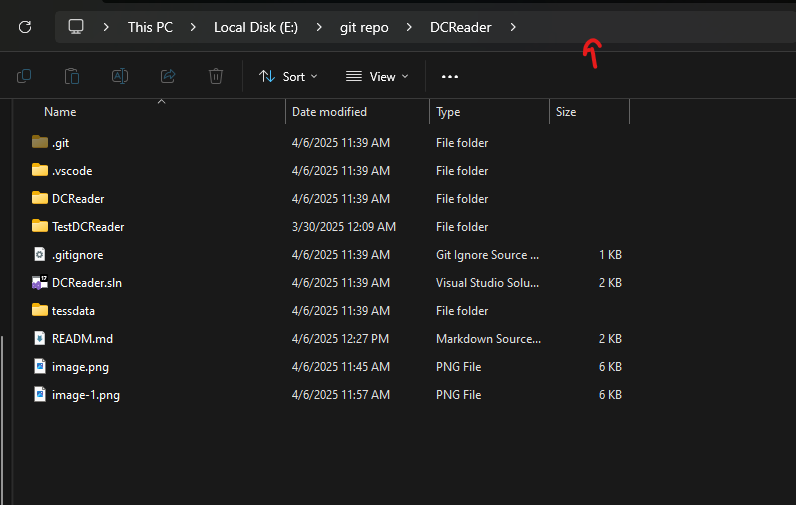
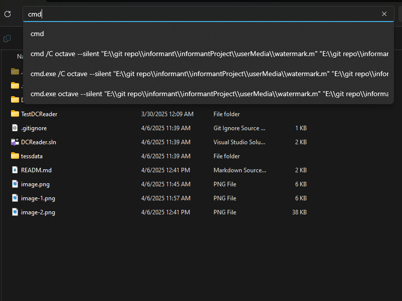
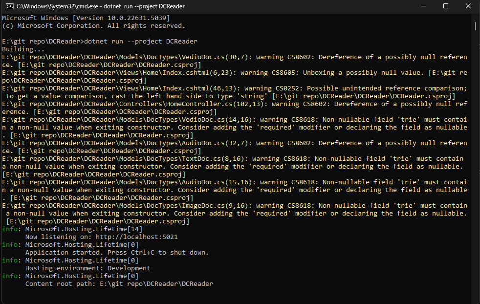
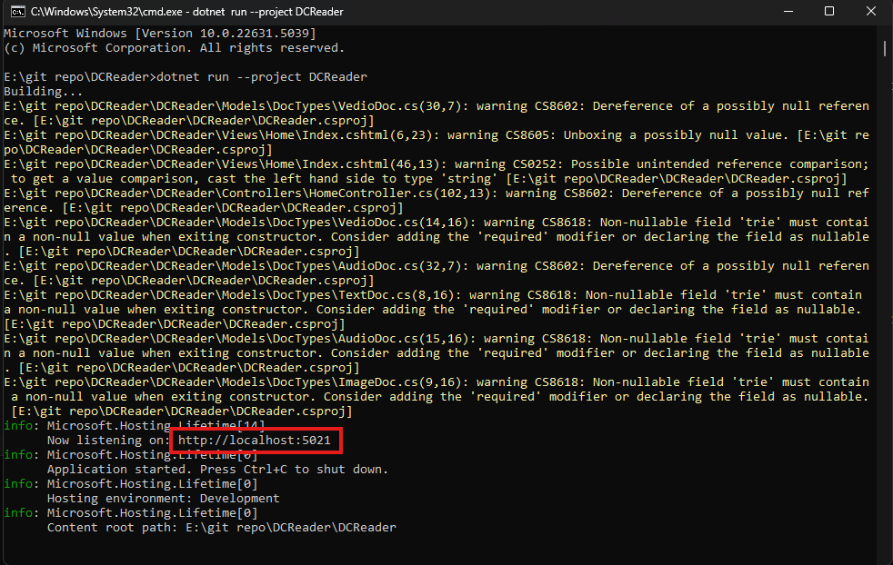

# How to install this application if installer not work

## Check If those things already installed and install what is missing

1. check whether .Net installed

```powershell
dotnet --version
```


If the didn't return a number like Then [install .net: https://dotnet.microsoft.com/en-us/download/dotnet/8.0](https://dotnet.microsoft.com/en-us/download/dotnet/8.0)

2. Check whether winget

```powershell
winget --version
```


If didn't return a number just write this command

```powershell
$progressPreference = 'silentlyContinue'
Write-Host "Installing WinGet PowerShell module from PSGallery..."
Install-PackageProvider -Name NuGet -Force | Out-Null
Install-Module -Name Microsoft.WinGet.Client -Force -Repository PSGallery | Out-Null
Write-Host "Using Repair-WinGetPackageManager cmdlet to bootstrap WinGet..."
Repair-WinGetPackageManager
Write-Host "Done."
```

3. check whether git installed

```powershell
git --version
```

same if no error then you are okay else use [install git: https://git-scm.com/downloads](https://git-scm.com/downloads)

4. check wheter ffmpeg is installed or not

```powershell
ffmpeg -version
```

if no error then you are okay else use this command to install ffmpeg

```powershell
winget install --id=Gyan.FFmpeg  -e
```
___

## Installing the application it self (cloing style)

```powershell
git clone https://github.com/mohamedA122ouz/DCReader.git
```
## Run the application 

1. Click mouse here


2. type cmd and press enter


3. type this command into the cmd

```bash
dotnet run --project DCReader
```
this is the output 


4. Now copy this link and past it into any browser tab


